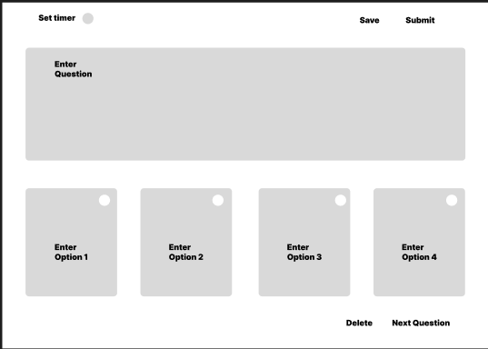

# 🧠 Online Quiz Platform – UI/UX Design (Figma)

This repository showcases the **UI/UX design** of an **Online Quiz Conducting Platform**, designed using **Figma**. The design emulates a full-stack MERN (MongoDB, Express, React, Node.js) architecture, focusing on modern user experience, responsive layout, and real-time interactions.

## 🔗 Figma Design Link
[👉 View Design on Figma](https://www.figma.com/design/jJdcxkUbm5AtgyBcTWCdi5/MernStack?node-id=0-1&t=pPgSebDlx8ykZ2nL-1)

---

## 🧩 Project Overview

This project is an interactive quiz platform that allows **admins to create contests and quizzes**, and **players to join using a unique code**. Built for scalability and engagement, it includes real-time participation and automated scoring.

### 👤 Admin Features:
- Create & manage quiz contests
- Add questions (with or without images)
- Set a timer per question
- Publish contest to generate a **unique code**
- Start/stop quiz control
- Auto-calculated leaderboard

### 🙋‍♂️ Player Features:
- Join quiz using a **contest code**
- Answer questions under time limit
- View final scores on **leaderboard**
- Top 3 winners displayed prominently

---

## 📸 Screenshots

| Landing Page | Admin Dashboard | Question Setup | Join Quiz | Live Quiz | Leaderboard |
|--------------|------------------|----------------|-----------|-----------|-------------|
|  |   |  |  |

> Be sure the screenshots folder has all the above images with matching names.

---

## 📁 Files Included
- `screenshots/` – Exported images of Figma frames
- `QuizCraft.pdf` – All frames in a single PDF

---

## 🛠️ Tools & Techniques
- **Figma** – Wireframes, UI components, auto layout
- Prototyping for page transitions
- Responsive-first design

---

## 📚 Use Cases
- Frontend development reference for MERN projects
- UI/UX design portfolio item
- Real-time quiz platform inspiration

---

Made with ❤️ by [Your Name]  
Designed using [Figma](https://www.figma.com)
